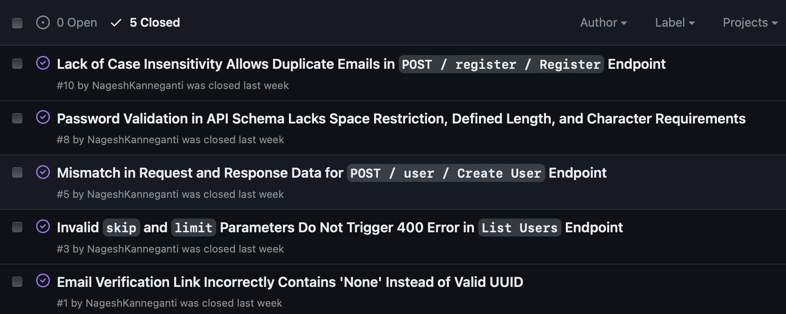
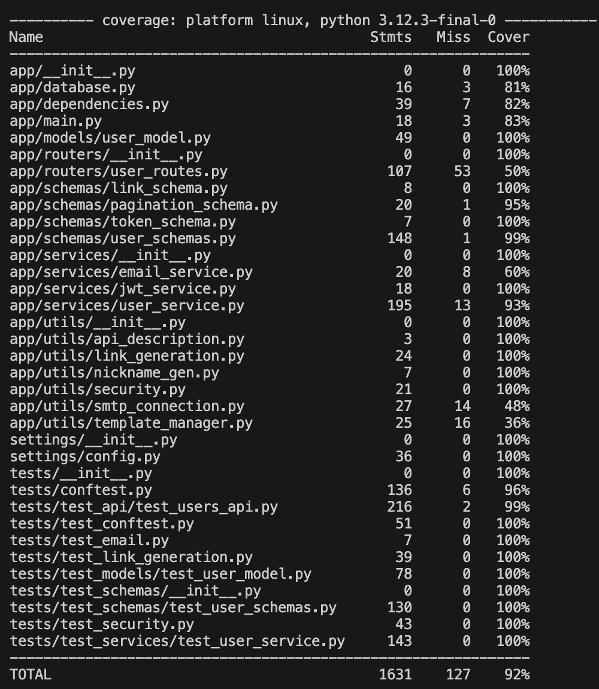
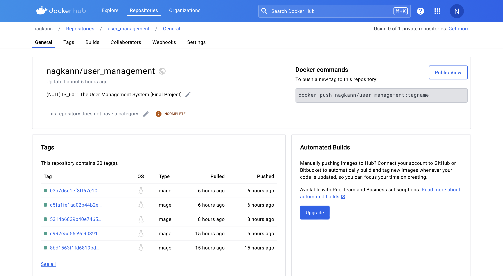

# The User Management System
## IS_601 Final Project
 

## Summary of Issues

 

## Issues and Solutions

| Issue ID | Title | Issue Link | Solution | Files Changed |
|----------|-------|------------|----------|---------------|
| #10 | Lack of Case Insensitivity Allows Duplicate Emails in `POST / register / Register Endpoint` | [View Issue](https://github.com/NageshKanneganti/user_management/issues/10) | [View Solution](https://github.com/NageshKanneganti/user_management/pull/11) | [View Changes](https://github.com/NageshKanneganti/user_management/pull/11/files) |
| #8 | Password Validation in API Schema Lacks Space Restriction, Defined Length, and Character Requirements | [View Issue](https://github.com/NageshKanneganti/user_management/issues/8) | [View Solution](https://github.com/NageshKanneganti/user_management/pull/9) | [View Changes](https://github.com/NageshKanneganti/user_management/pull/9/files) |
| #5 | Mismatch in Request and Response Data for `POST / user / Create User` Endpoint | [View Issue](https://github.com/NageshKanneganti/user_management/issues/5) | [View Solution](https://github.com/NageshKanneganti/user_management/pull/6) | [View Changes](https://github.com/NageshKanneganti/user_management/pull/6/files) |
| #3 | Invalid `skip` and `limit` Parameters Do Not Trigger 400 Error in `List Users` Endpoint | [View Issue](https://github.com/NageshKanneganti/user_management/issues/3) | [View Solution](https://github.com/NageshKanneganti/user_management/pull/4) | [View Changes](https://github.com/NageshKanneganti/user_management/pull/4/files) |
| #1 | Email Verification Link Incorrectly Contains 'None' Instead of Valid UUID | [View Issue](https://github.com/NageshKanneganti/user_management/issues/1) | [View Solution](https://github.com/NageshKanneganti/user_management/pull/2) | [View Changes](https://github.com/NageshKanneganti/user_management/pull/2/files) |
 

## New Features Implementation

| Feature | Files Changed |
|---------|---------------|
| [Implement User Profile Management](https://github.com/NageshKanneganti/user_management/pull/12) | [View Changes](https://github.com/NageshKanneganti/user_management/pull/12/files) |
| [Implement User Professional Status Upgrade Functionality](https://github.com/NageshKanneganti/user_management/pull/13) | [View Changes](https://github.com/NageshKanneganti/user_management/pull/13/files) |
 

## Links to Specific Tests

### Schema Tests
- [Edge case & functional tests for password validation](https://github.com/NageshKanneganti/user_management/blob/8b1885a908f4f45bc49fcb8cef80e1a1524928a4/tests/test_schemas/test_user_schemas.py#L112-L133)
- [Test for email validation](https://github.com/NageshKanneganti/user_management/blob/8b1885a908f4f45bc49fcb8cef80e1a1524928a4/tests/test_schemas/test_user_schemas.py#L135-L153)
- [Edge case and functional tests for the *User Profile Management* feature](https://github.com/NageshKanneganti/user_management/blob/8b1885a908f4f45bc49fcb8cef80e1a1524928a4/tests/test_schemas/test_user_schemas.py#L155-L254)

### Route Tests
- [Edge case test for `skip` and `limit` parameters](https://github.com/NageshKanneganti/user_management/blob/8b1885a908f4f45bc49fcb8cef80e1a1524928a4/tests/test_api/test_users_api.py#L196-L213)
- [Functional tests for `List User` endpoint](https://github.com/NageshKanneganti/user_management/blob/8b1885a908f4f45bc49fcb8cef80e1a1524928a4/tests/test_api/test_users_api.py#L215-L230)
- [Functional tests for `Create User` endpoint](https://github.com/NageshKanneganti/user_management/blob/8b1885a908f4f45bc49fcb8cef80e1a1524928a4/tests/test_api/test_users_api.py#L232-L262)
- [Functional test for new feature, `User Profile Management` endpoint](https://github.com/NageshKanneganti/user_management/blob/8b1885a908f4f45bc49fcb8cef80e1a1524928a4/tests/test_api/test_users_api.py#L264-L285)
- [Error scenario tests for new feature '`User Profile Management` endpoint](https://github.com/NageshKanneganti/user_management/blob/8b1885a908f4f45bc49fcb8cef80e1a1524928a4/tests/test_api/test_users_api.py#L287-L323)
- [Functional test for `Set Professional` endpoint](https://github.com/NageshKanneganti/user_management/blob/8b1885a908f4f45bc49fcb8cef80e1a1524928a4/tests/test_api/test_users_api.py#L287-L323)
- [Error scenario test for updating professional status](https://github.com/NageshKanneganti/user_management/blob/8b1885a908f4f45bc49fcb8cef80e1a1524928a4/tests/test_api/test_users_api.py#L341-L351)

### Service Tests
- [Error scenario test for sending email verification](https://github.com/NageshKanneganti/user_management/blob/8b1885a908f4f45bc49fcb8cef80e1a1524928a4/tests/test_services/test_user_service.py#L166-L199)
- [Functional test for `create_user` with unique nickname](https://github.com/NageshKanneganti/user_management/blob/8b1885a908f4f45bc49fcb8cef80e1a1524928a4/tests/test_services/test_user_service.py#L202-L214)
- [Error scenario tests for duplicate nickname and email](https://github.com/NageshKanneganti/user_management/blob/8b1885a908f4f45bc49fcb8cef80e1a1524928a4/tests/test_services/test_user_service.py#L202-L214)
- [Functional and error scenario tests for updating professional status](https://github.com/NageshKanneganti/user_management/blob/8b1885a908f4f45bc49fcb8cef80e1a1524928a4/tests/test_services/test_user_service.py#L202-L214)
 

## Coverage Report

 

## GitHub Actions
[Link to GitHub Workflows](https://github.com/NageshKanneganti/user_management/actions)
 

## GitHub Commits
[Link to Commits](https://github.com/NageshKanneganti/user_management/commits/main/)
 

## Dockerhub
[Link to Dockerhub Repo](https://hub.docker.com/repository/docker/nagkann/user_management/general)
